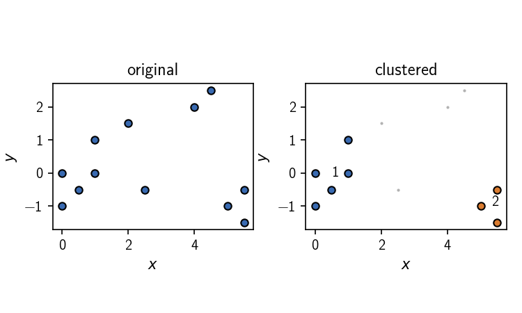

[](https://github.com/bkellerlab/CommonNNClustering)


Common-nearest-neighbour clustering
===================================

The `commonnn` Python package provides a flexible interface to use the <b>c</b>ommon-<b>n</b>earest-<b>n</b>eighbour (CommonNN) clustering procedure. While the method can be applied to arbitrary data, this implementation was made before the background of processing trajectories from Molecular Dynamics (MD) simulations. In this context the cluster result can serve as a suitable basis for the construction of a core-set Markov-state (cs-MSM) model to capture the essential dynamics of the underlying molecular processes.

The commonnn package
--------------------

The package provides a main module:

  - `cluster`: User interface to (hierarchical) CommonNN clustering

Further, it contains among others the modules:

  - `plot`: Convenience functions to evaluate cluster results
  - `_types`: Direct access to generic types representing needed cluster components
  - `_fit`: Direct access to generic clustering procedures

Features:

  - Flexible: The clustering can be done for data sets in different input formats. Internal parts of the procedure can be exchanged. Interfacing with external methods is made easy.
  - Convenient: Integration of functionality, which may be handy in the context of MD data analysis.
  - Fast: Core functionalities have been implemented in Cython.

Please refer to the following papers for the scientific background (and consider citing if you find the method useful):

  - J.-O. Kapp-Joswig, B. G. Keller *J. Chem. Inf. Model.*, __2023__, *63(4)*, 1093 (doi: 10.1021/acs.jcim.2c01493).
  - O. Lemke, B.G. Keller *Algorithms*, __2018__, *11*, 19.
  - O. Lemke, B.G. Keller *J. Chem. Phys.*, __2016__, *145*, 164104.
  - B. Keller, X. Daura, W. F. van Gunsteren *J. Chem. Phys.*, __2010__, *132*, 074110.
  

Documentation
-------------

The package documentation is available [here](https://bkellerlab.github.io/CommonNNClustering/) online or under `docs/index.html`.
The sources for the documentation can be found under `docsrc/` and can be built using Sphinx.

Install
-------

Refer to the [documentation](https://bkellerlab.github.io/CommonNNClustering/_source/install.html) for more details. Install from PyPi

```bash
$ pip install commonnn-clustering
```

or clone the development version and install from a local branch

```bash
$ git clone https://github.com/bkellerlab/CommonNNClustering.git
$ cd CommonNNClustering
$ pip install .
```

Quickstart
----------

```python
>>> from commonnn import cluster

>>> # 2D data points (list of lists, 12 points in 2 dimensions)
>>> data_points = [   # point index
...     [0, 0],       # 0
...     [1, 1],       # 1
...     [1, 0],       # 2
...     [0, -1],      # 3
...     [0.5, -0.5],  # 4
...     [2,  1.5],    # 5
...     [2.5, -0.5],  # 6
...     [4, 2],       # 7
...     [4.5, 2.5],   # 8
...     [5, -1],      # 9
...     [5.5, -0.5],  # 10
...     [5.5, -1.5],  # 11
...     ]

>>> clustering = cluster.Clustering(data_points)
>>> clustering.fit(radius_cutoff=1.5, similarity_cutoff=1, v=False)
>>> clustering.labels
array([1, 1, 1, 1, 1, 0, 0, 0, 0, 2, 2, 2])

```



Alternative scikit-learn implementation
---------------------------------------

We provide an alternative approach to CommonNN clustering in the spirit of the scikit-learn project within [scikit-learn-extra](https://github.com/scikit-learn-contrib/scikit-learn-extra).

Development history
-------------------

The present development repository has diverged with changes from the original one under [github.com/janjoswig/CommonNNClustering](https://github.com/janjoswig/CommonNNClustering).

A previous implementation of the clustering can be found under
[github.com/bettinakeller/CNNClustering](https://github.com/bettinakeller/CNNClustering).
